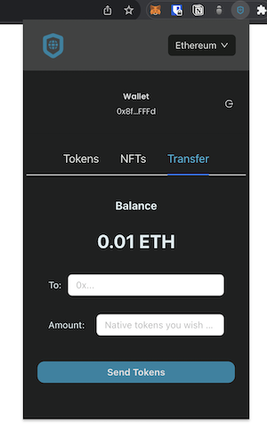

# AllWallet: A Web Crypto Wallet Extension

## About

A crypto wallet web extension that allows a user to create a wallet or connect to an existing wallet, see all their tokens and NFTs, and transfer them to other addresses.

It does not implement account/password management but instead uses the seed phrase to open an account.

This repo uses Moralis as the Crypto data provider. The app/extension retrieves the following data using Moralis endpoints:

- The full list of cryptos stored in a wallet
- The full list of NFTs
- The wallet's balance

The Ethers library is used to send tokens.

Along with React, this uses Ant Design which makes creating tabs very simple, where a user can switch between, the Tokesn, NFTs, and Crypto transfers on the same wallet screen.

To quickly test this extension, the `build` folder can uploaded as is as a Chrome Extension. More information in the next section.

<div style="margin:40px; display:flex; gap:20px; justify-content:center; flex-direction: row; position: relative; overflow-y: auto;">
    
    
    
</div>
<div style="margin:10px; display:flex; gap:20px; justify-content:center; flex-direction: row; position: relative; overflow-y: auto;">
    
    
    
</div>

## Requirements and Setup

### Required Technologies and Libraries

```
Frontend:
    Node v16.20.2
    React.js 18.2.0
    Ant Design 5.0.1
    Axios 1.3.5
    Ethers 6.3.0

Backend:
    Express
    Moralis
```

### Deployment Instructions

- Create an account with Moralis and obtain an API Key:

```
https://moralis.com
```

- Update the `.env` file with your API Key:

```
/backend/.env
```

- Install all requisite npm packages under the `backend` directory:

```
npm install
```

- Install all requisite npm packages under the `allwalet` directory:

```
npm install
```

- Launch the backend express server:

```
node index.js
```

- Start the frontend web server:

```
npm run start
```

- To test the app/extension:

```
http://localhost:3000
```

- To run the extension in Chrome, upload the `build` folder:

```
/allwallet/build
```
